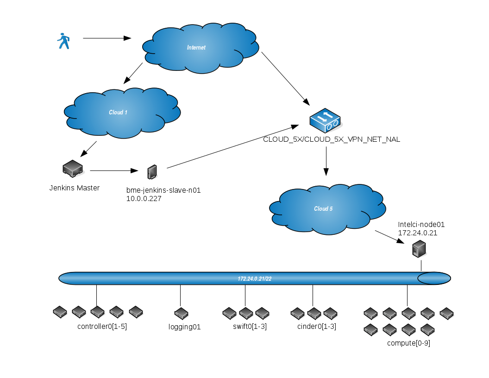
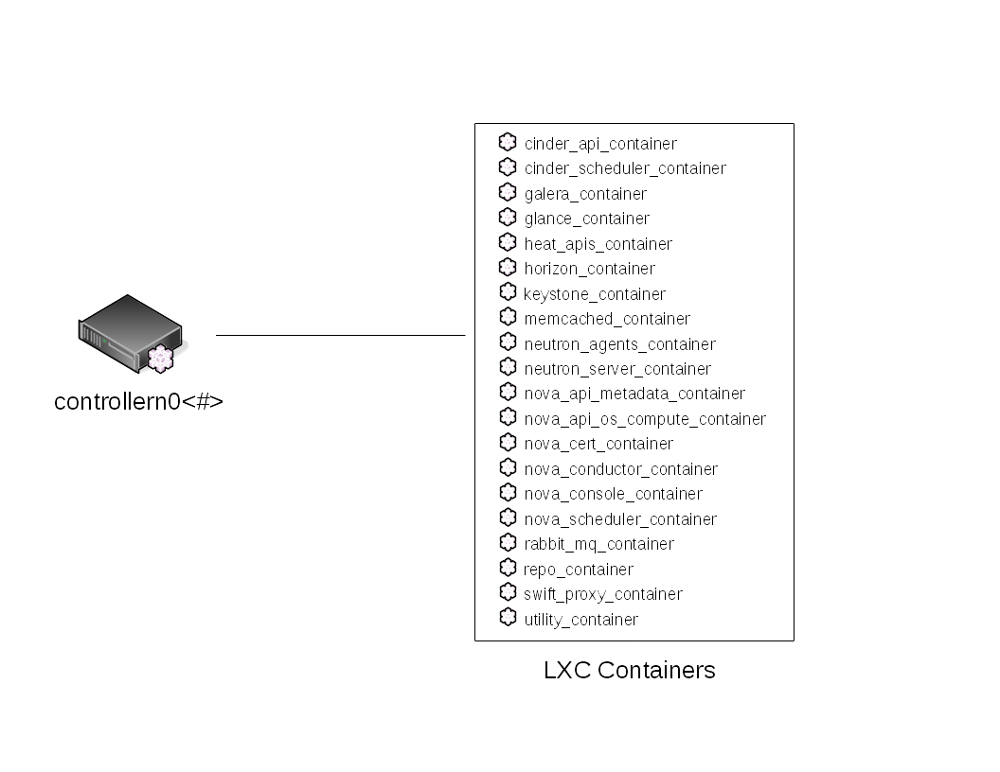
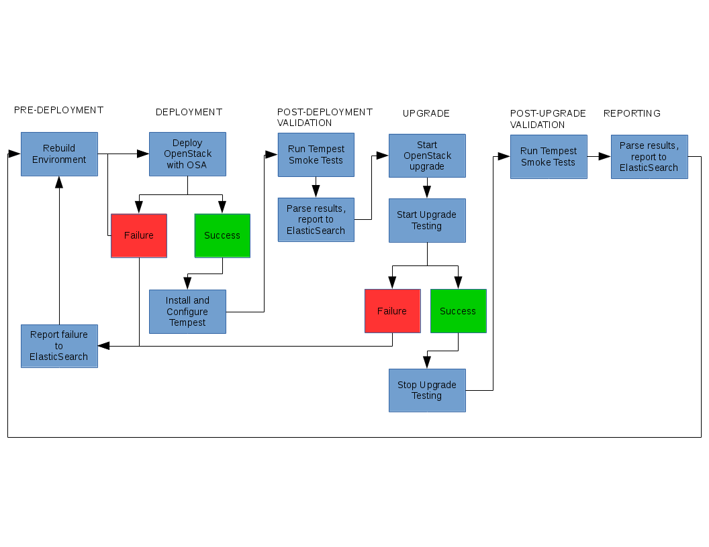

#Bare Metal Environment(BME)
Currently implemented in Cloud5. This is a 22 node environment which uses bare metal servers for deploy of OpenStack via [OpenStack-Ansible](https://github.com/openstack/openstack-ansible).

##Access
This does require a VPN with user/pass. In order to ease access concerns, this environment can be accessed through the bme-jenkins-slave-n01 via the jumpbox.

###VPN - f5fpc
This command line client is used to enable/disable a VPN to the Cloud5 environment.

* View connection status
*  * `f5fpc --info`
* Connect to VPN on Cloud5 **env variables are set on login for ubuntu user on bme-jenkins-slave-n01**
*  * `f5fpc --start --host ${CLOUD_HOST} --user ${CLOUD_USER} --password ${CLOUD_PASS} --nocheck`
* Connect to intelci-node01 (deploy node) **SSH keys used for access**
*  * `ssh root@172.24.0.21`
* Disconnect to VPN on Cloud5 **do not disconnect VPN if a job is running on this environment**
*  * `f5fpc --stop`

##Nodes
On intelci-node01, hosts file is configured for all nodes. SSH is keyed throughout environment *ex. `ssh controller01`*.

Nodes:    

Each controller node has multiple containers:    

##CI/CD Workflow
This is a work in progress as the environment is being configured and tested, process workflow is being implemented as:    
